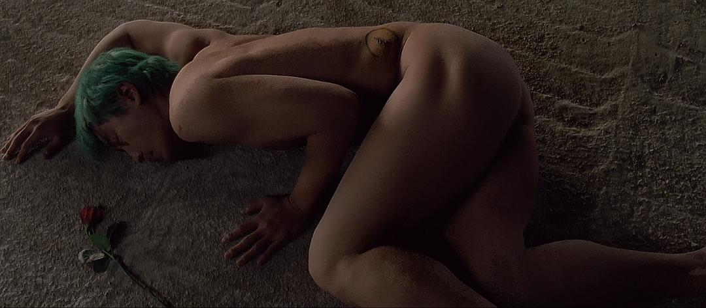
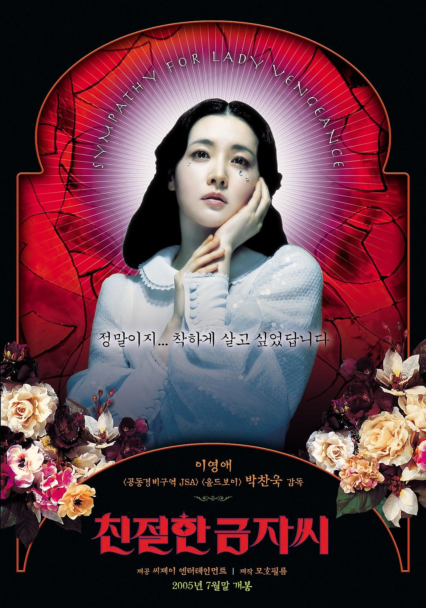
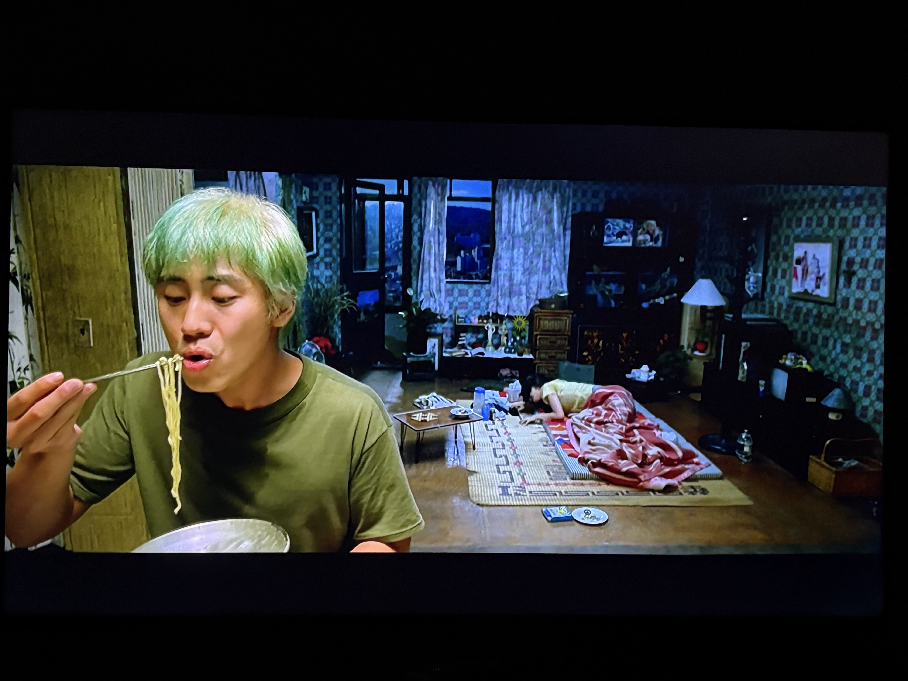

> I know you are a good guy, so you know the reason, I have to kill you, right? ----《Sympathy for Mr. Vengence》

## 写在前面

想写博客的起因是在朋友家看了奉俊昊的《母亲》，两个多小时的电影，看完之后又聊了两个小时，回到家里已经是凌晨三点多了。期间他说他想起了《老男孩》的一个片段，便问我看过《老男孩》没有。我说没有，便在三个晚上接连看完了朴赞郁的复仇三部曲。

我观影的顺序是《老男孩》，《我要复仇》，最后《亲切的金子》。《老男孩》癫狂暴力，《我要复仇》沉闷压抑，《亲切的金子》华丽优雅，很难想象这三部作品是同一个人在5年内连续完成的。不同于《杀死比尔》《极速追杀》中简单的善恶观和爽快的杀戮，朴的复仇有着古希腊式的宿命悲剧以及强烈的宗教意味：《我要复仇》中Ryu被摘下器官后的裸体，鲜花和荒地，《老男孩》中主角O Dae-Su和O-i-di-pu-seu（俄狄浦斯）读音的接近，《亲切的金子》中Geum-ja的海报形象甚至直接是圣母玛利亚。即便如此，三部影片在复仇的内核动力、表现形式、执行方式，以及复仇的结果都各不相同。在朴赞郁的镜头下，复仇不再是单纯的动作叙事，而是一种现代悲剧的书写，三部调性不同的乐章最终汇成一个主题 ---- 复仇不是终点，而是人类情感在荒野上的回声。

<figure>
  
  <figcaption>图：《我要复仇》中Ryu偷肾后被丢弃</figcaption>
</figure>

<figure>
  
  <figcaption>图：《亲切的金子》的海报</figcaption>
</figure>

## 我要复仇

### 声音

整部电影给我最大的感觉是安静，安静的让人害怕，身旁夏末的蝉鸣甚至让我一度以为是电影里的声音。整部电影最血腥的几处镜头：
  <input type="checkbox" id="isp-1" class="ispoiler-cb">
<label for="isp-1" class="ispoiler-content">Ryu的复仇，Ryu的死，Dong-jin的死</label> 
，都没有任何音乐和对白，仿佛死亡是人们理所当然的日常一般，不值得任何感情上的波澜。这种没有声音所带来的绝望和无力感也体现在主角身上：作为聋哑人的Ryu听不见姐姐的呻吟声，在她痛苦的时候无法给予回应。而在姐姐死亡之际，他痛苦的哀嚎也无人能够听见。声音的缺失让影片的情绪——孤独、悲伤、愤怒都没有出口，只能在观众心底回荡。到最后，观众只能在一片压抑的静默中接受这场复仇与被复仇的轮回，像是被迫置身其中的一块石头，连逃避都来不及。

<figure>
  
  <figcaption>图：《我要复仇》中Ryu听不见姐姐的呼救</figcaption>
</figure>

