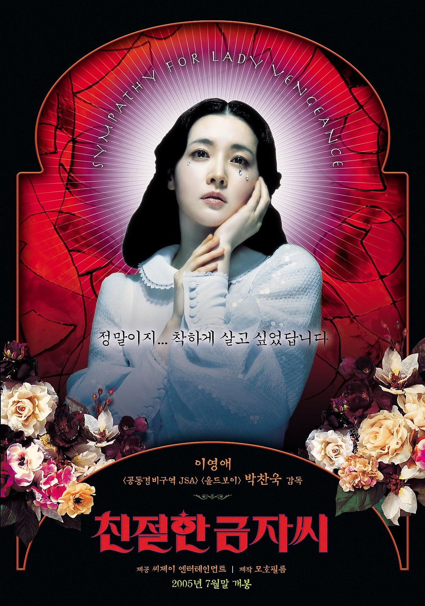
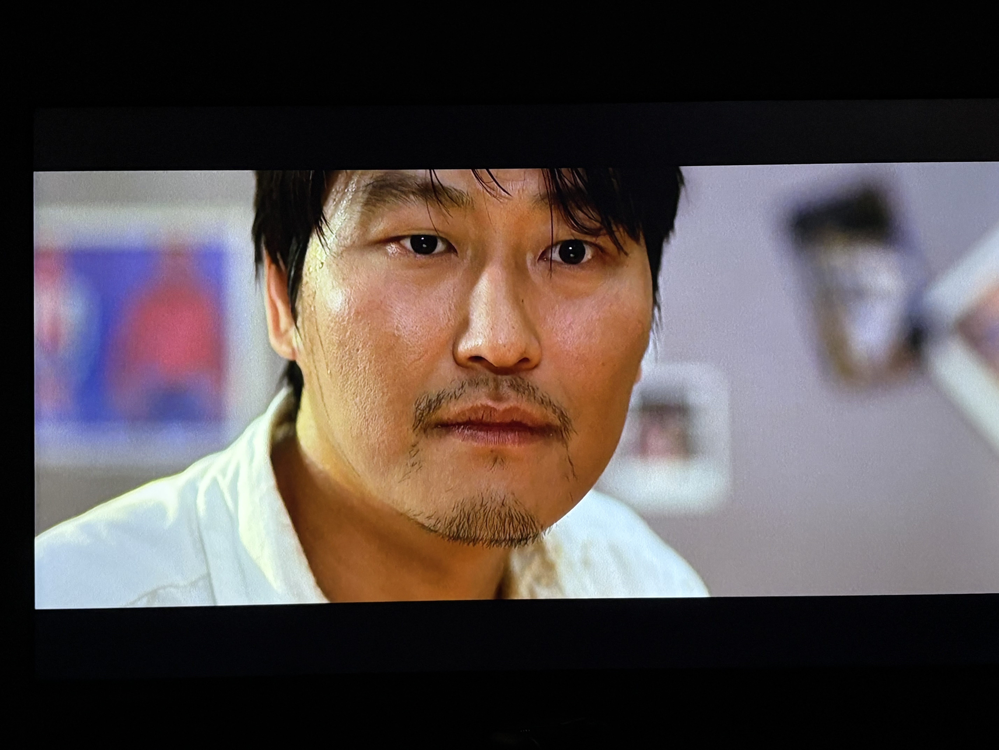
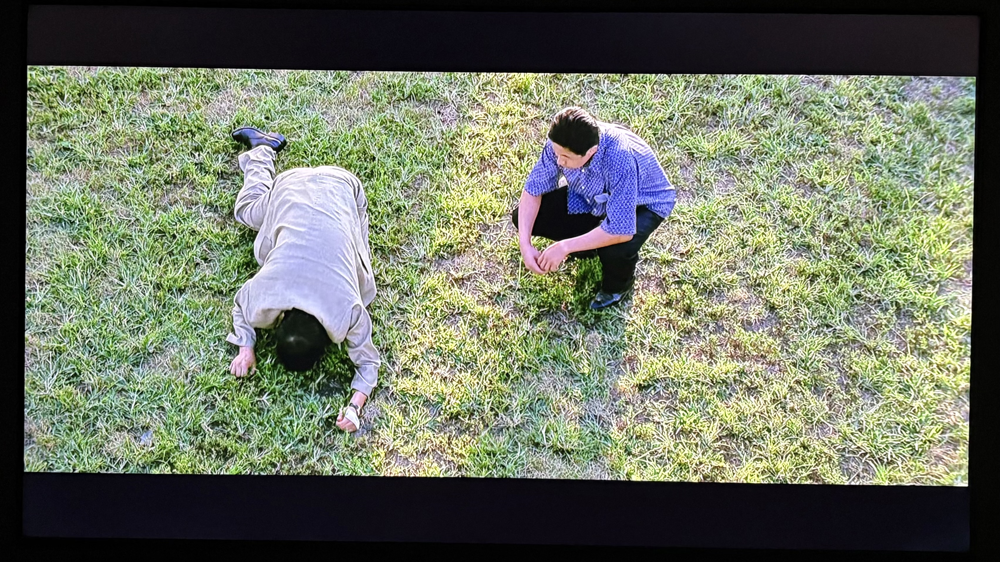

> I know you are a good guy, so you know the reason, I have to kill you, right? ——《Sympathy for Mr. Vengence》

## 写在前面

想写博客的起因是在朋友家看了奉俊昊的《母亲》，两个多小时的电影，看完之后又聊了两个小时，回到家里已经是凌晨三点多了。期间他说他想起了《老男孩》的一个片段，便问我看过《老男孩》没有。我说没有，便在三个晚上接连看完了朴赞郁的复仇三部曲。

我观影的顺序是《老男孩》，《我要复仇》，最后《亲切的金子》。《老男孩》癫狂暴力，《我要复仇》沉闷压抑，《亲切的金子》华丽优雅，很难想象这三部作品是同一个人在5年内连续完成的。不同于《杀死比尔》《极速追杀》中简单的善恶观和爽快的杀戮，朴的复仇有着古希腊式的宿命悲剧以及强烈的宗教意味：《我要复仇》中Ryu被摘下器官后的裸体，鲜花和荒地，《老男孩》中主角O Dae-Su和O-i-di-pu-seu（俄狄浦斯）读音的接近，《亲切的金子》中Geum-ja的海报形象甚至直接是圣母玛利亚。即便如此，三部影片在复仇的内核动力、表现形式、执行方式，以及复仇的结果都各不相同。在朴赞郁的镜头下，复仇不再是单纯的动作叙事，而是一种现代悲剧的书写，三部调性不同的乐章最终汇成一个主题 ---- 复仇不是终点，而是人类情感在荒野上的回声。

<figure>
  
  <figcaption>《亲切的金子》的海报</figcaption>
</figure>

## 我要复仇

### 声音

整部电影给我最大的感觉是安静，安静的让人害怕，身旁夏末的蝉鸣甚至让我一度以为是电影里的声音。整部电影最血腥的几处镜头：
  <input type="checkbox" id="isp-1" class="ispoiler-cb">
<label for="isp-1" class="ispoiler-content">Ryu的复仇，Ryu的死，Dong-jin的死</label> 
，都没有任何音乐和对白，仿佛死亡是人们理所当然的日常一般，不值得任何感情上的波澜。这种没有声音所带来的绝望和无力感也体现在主角身上：作为聋哑人的Ryu听不见姐姐的呻吟声，在她痛苦的时候无法给予回应。
  <input type="checkbox" id="isp-2" class="ispoiler-cb">
<label for="isp-2" class="ispoiler-content">而在姐姐死亡之际，他痛苦的哀嚎也无人能够听见。</label> 声音的缺失让影片的情绪——孤独、悲伤、愤怒都没有出口，只能在观众心底回荡。在这片压抑的静默中，我们只能被迫注视，无法发声。

<figure>
 <video controls width="600">
  <source src="video/我要复仇吃面.mp4" type="video/mp4">
  你的浏览器不支持 video 播放
</video>
  <figcaption>Ryu听不见姐姐的呼救</figcaption>
</figure>

在安静的基调之外，影片也会时不时用诡异而扭曲的音乐给予观众精神上的刺激：

<audio controls preload="metadata" style="width:100%">
  <source src="audio/sapjil.mp3" type="audio/mpeg">
  你的浏览器不支持音频播放
</audio>
凌乱的节拍，乱跳的琴键，金属般恼人的刮擦声，这段音乐放在任何一个电影都显得格格不入，但在《我要复仇》里，这种声音却在影片中多次出现，像是带着钢筋外表的畸形怪物骤然闯入，又立马消失。它第一次出现是在Ryu被偷取肾脏之后：Ryu拖着麻醉未醒的身体挣扎地爬起，努力睁开眼睛想弄清楚究竟发生了什么。镜头摇晃着拉远，丑陋的噪音反复拉扯，撕开了原本的沉默。焦躁和不安被强行拉到画面前，仿佛是在阻止我们逃走——“你看到我了吗？为什么是我？我该怎么办？为什么是我？” 

<figure>
  <video controls width="600">
  <source src="video/我要复仇偷肾.mp4" type="video/mp4">
  你的浏览器不支持 video 播放
</video>
  <figurecaption>Ryu被偷肾后丢弃在烂尾楼里</figurecaption>
</figure>

影片就这样在沉默和噪音的交错中展开，每一次怪异声音的闯入都是角色躁郁与痛苦的短暂爆发；可它们随即又被压了回去，重新归于死寂。到最后，我们只能在一片压抑的静默中接受这场复仇与被复仇的轮回，像是被迫置身其中的一块石头，连逃避都来之不及。

### 人物

如果有人问我看电影时最关注什么，我会毫不犹豫地回答：人物。我觉得人物总是电影的核心。故事可以乏味、情节可以无聊，但只要人物是复杂而有趣的，电影就依旧能够打动我（点名批评《春光乍泄》）。

《我要复仇》的人物描绘十分独特。他们之间差异鲜明：Ryu的思维总是能创造意想不到的笑点，像个长不大的孩子；Dong-jin的老实和冷静让人几乎忘了他是个大企业的老板；Yeong-mi则是影片里少数带着活力的人物，她既古灵精怪，又带着激进的理想主义。然而，他们又都有着相同的气质和处境：没有谁是真正的恶人，也没有谁是无辜的，所有人都被命运裹挟在一条曲折小路上推搡着前进，走向一个早已注定的黑暗。导演没有给他们明确的善恶立场，而是在影片中不断切换视角，让观众始终无法轻易站队。

影片在塑造人物时，有两种镜头给我的印象特别深刻：特写和俯瞰。如同任何一本镜头语言的教科书都会提到的，特写让我们直面人的内心世界，俯瞰则如同上帝一般窥视人的命运，这两种镜头都在《我要复仇》里被极致地运用：眼神的特写在影片安静的基调下让人物内心的波动无处遁形；而俯瞰镜头也“恰好”出现在了每一次悲剧的现场。

<figure>
  
  <figcaption>Dongjin的面部特写</figcaption>
</figure>

<figure>
  
  <figcaption>Dongjin跪在草坪上的俯瞰镜头</figcaption>
</figure>

群像的描绘与镜头的运用共同营造出一种格外冷峻的质感。你无法只关注某一个人，因为他们都在同一张网里彼此牵连；你也无法完全同情或谴责，因为他们每一步都带着无可避免的必然性。最终，他们汇聚成一幅压抑的群像画像，引用朋友Filippo说的一句话就是：”Like everyone loses against the world in the end. And it's not even because you're a victim of some conspiracy against you, you're just beaten by the chaos of an indifferent and menacing world“。

## 亲切的金子

### 仪式

老实说，《亲切的金子》在三部曲中是我觉得最为普通的一部：朴实的善恶观，略显单薄的人物，毫无曲折的复仇道路。然而，集体复仇的戏码给我留下了极为深刻的印象。金子邀请受害者家属们聚集到一起，观看他们孩子被受虐致死的影片。家属们从最开始的理智到愤怒，从被迫到主动参与到了这场复仇之中。

### 天使

> In Frence, when there's a break in the conversation like this, they say an angel is passing——《Sympathy for Lady Vengeance 》

想写《亲切的金子》的时候，正好在听王菲的《天使》，突然觉得天使这个词和电影很配。在一般的语境下，天使是美丽纯洁的象征，但在亚伯拉罕诸教中，也有堕落天使的存在：本该指引和守护灵魂的天堂使者，也可能因为诱惑人类犯罪而被逐出天堂。在这一点上，金子的形象与堕落天使如出一辙。

最著名的堕落天使路西法在《失乐园》里变成了撒旦，誓要与上帝为敌，永不悔改。而金子却始终明白自己是个罪人，仍想找回曾经作为“天使”的一面。她对女儿Jenny说： "People make mistakes. If you've commited a sin, you have to make atonement for that sin. "  在她看来，复仇并不是单纯的报复，而是一种赎罪。为了达成这个目的，她在监狱中隐忍了13年，利用了无数人，把自己当作了一个冷酷的工具。讽刺的是，Jenny得知妈妈的罪行后问：“Do you want me to say sorry to his mother？"—— 在Jenny眼里，在真正的天使的眼里，没有什么罪行是一句道歉解决不了的。

在影片的结尾，金子把头埋入白色的蛋糕里哭泣。在一片大雪之中，穿着白色睡衣的Jenny紧紧搂着妈妈，整个世界中只有金子是一身黑色的。她对女儿说，“Be white and live white, like this.” 她希望女儿能延续她未竟的“天使”身份。但她自己是否真正得到了救赎？答案似乎是否定的。旁白冷静地评价道：“Lee Geum-ja made a great mistake in her youth, and used other people to achieve her goals. But she still couldn't find the redemption she so desired.“ 即便大口吃下象征洁白的蛋糕，她内心的空虚依然无法填补。然而，旁白也说到 “In spite of this, actually, because of this, I liked Geum-ja.” 尽管得不到救赎，金子的泪水中仍有光亮，她不是像路西法那样永远与神为敌的象征。她只是一个在人世间拼命挣扎、渴望救赎却无法回头的凡人。正因如此，我喜欢金子。

